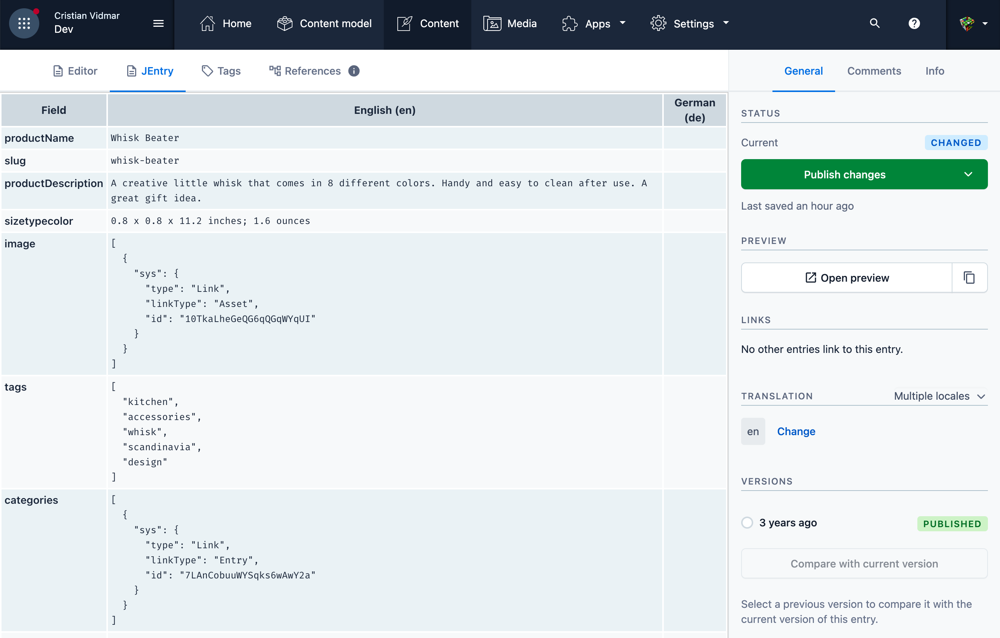
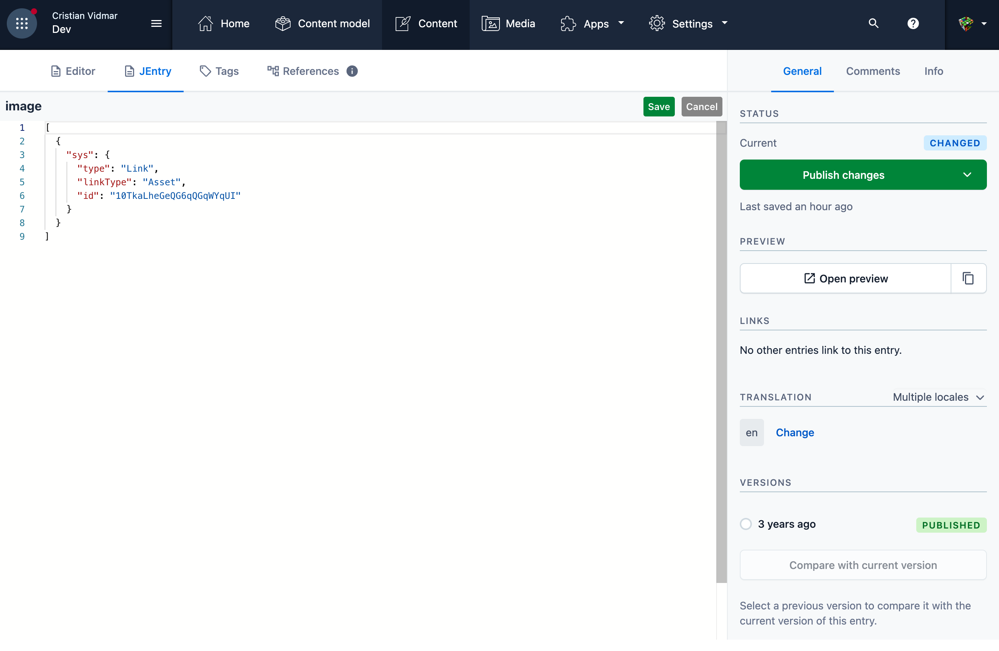

An alternative entry editor for Contentful that displays raw field values and lets you copy and edit Object (JSON) fields:

## How to use

1. Clone the repository
1. In a terminal, cd to the repo and `npm run build`. This will create a `build` directory
1. Log in to Contentful, navigate to the Apps menu and choose Manage Apps and then Manage Private Apps
1. Click on Create App and when prompted give the app the name "JEntry"
1. In the App definition form:
  * Select "Hosted by Contentful" under "Frontend"
  * Drag the "build" directory from your local repo to the drop area
  * Select "Entry editor" in the "Locations" section
  * Save the app
1. Navigate to the space you want to install the app to and choose Manage Apps from the Apps menu 
1. Find the JEntry app in the "Available" section, click the three dots at the right and choose "Install" and then "Authorize access"
1. Edit the content model for the content type you want to edit with JEntry, choose "Entry editors" and add "JEntry" from the "Available items". Drag JEntry to the second place in the list and Save the model.
1. You're done! Edit any entry of the content type above, there will be a new JEntry tab at the top.
